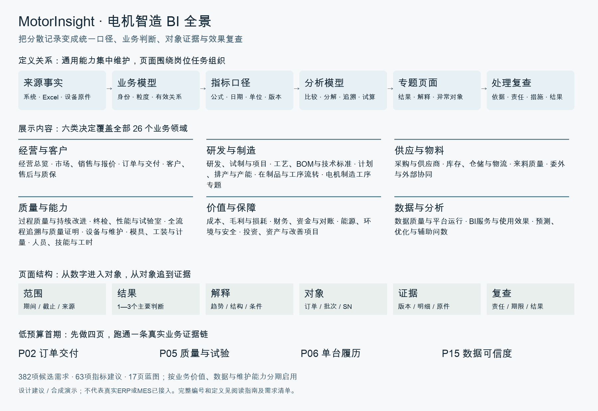

# MotorInsight · 电机智造数据与决策平台

当前版本：**0.23.0**。公开仓库：[ka33u/motor-insight](https://github.com/ka33u/motor-insight)。

面向全流程自制、小批量定制电机工厂，把部门 Excel、订单、工序、检测和原件组织为可追溯的数据、统一指标和岗位决策界面。

当前为**合成数据演示版本**。用友 U8 和 MES 的真实接口未接入。模拟结果用于研究、验算和功能验证，正式业务批准仍须在企业授权流程中执行。

## 快速运行

需要 Python 3.12。应用运行不依赖 Node.js；部分 Excel 生成脚本使用 Codex 的 artifact-tool，仓库已经附带导出的原始工作簿。

```sh
python3.12 -m venv .venv
.venv/bin/python -m pip install --require-hashes -r requirements.lock
.venv/bin/python scripts/bootstrap_demo.py
.venv/bin/python scripts/serve.py start
```

打开 <http://127.0.0.1:8765>。

初始化仅用于**不存在的新数据库**，依次通过平台正常服务导入42份当前有效的原始模拟Excel（另保留43份部门及映射演示工作簿），重建232,200条合成业务记录，再恢复52个分析模型、21个专题等合成分析配置。遇到无效引用或冲突会停下，不自动批准；不会覆盖本机已有数据库。

演示账号：`demo_admin`、`demo_analyst`、`demo_quality`、`demo_operations`、`demo_finance`、`demo_viewer`。本地演示口令为 `MotorDemo!2026`；这些是随演示重新生成的账号，不包含作者本机账号或登录会话。真实部署需配置独立密钥、关闭演示模式并建立正式账号体系。

```sh
.venv/bin/python scripts/serve.py status
.venv/bin/python scripts/serve.py stop
```

## 功能范围

| 领域 | 当前功能 |
|---|---|
| 数据采集 | Excel预览、字段映射、类型与引用检查、重复跳过、冲突隔离、修复及来源留痕 |
| 主数据与身份 | 订单行、配置、工单、材料批次、部件、单台SN、检测会话；自定义编码与版本；14类对象检索和直接引用 |
| 分析与专题 | 受控维度、分组、度量、派生、趋势、分布、透视、散点、模型保存、更新预演与定义历史、专题编排与跨专题范围预览 |
| 个人工作台 | 七类常用入口收藏、本人别名与分组、顺序、登录偏好、当前权限与定义状态核对 |
| 业务工作台 | 交付、质量、采购、库存、在制、成本资金、售后和协同跟进 |
| 制造能力 | 资源/人员日历、有限资源试排、物料与人机联立试排、订单与BOM基线核对、逐批冻结BOM假设试排、投产/首件证据、固化温度曲线、班次OEE及损失时间 |
| 证据与治理 | Excel行追溯、原件服务、指标口径版本、角色访问、受控导出与审计 |



先读 [BI决策与展示指南](outputs/BI决策与展示_阅读指南.txt) 和 [全部需求简明索引](outputs/BI需求全景_简明索引.txt)。

完整候选设计见 [BI方案](outputs/BI需求与呈现方案.html) 与 [382项需求](outputs/BI完整382项需求清单.txt)：26个领域、63项建议指标、17页蓝图，分别标记模拟部分覆盖和待建设。候选设计并不代表所有功能已验收。

现有[物料、人机联立试排](docs/物料人机联立试排.md)把BOM整批需求、共享物料FIFO、到料时间、设备、人员和资格窗口共同计算。BI保留全部任务和未排原因，提供双视角甘特、批次交期、用料及预留流水、来源和完整导出。10个独立案例覆盖缺料、晚到、隔离、缺人和资料暂停；当前为只读的保守启发式演练。

新增[两种派序对照](docs/联立试排策略对照.md)：在相同来源和假设下并列原有两种策略，逐批次区分更早、更晚、未排完与晚交，再核对任务人机、阻断和预留时间。两列均排完才比较批次完成时间；不同单位不合计。可返回对应策略、查看共同Excel来源并导出两列完整输入和结果。

新增[订单与BOM基线核对](docs/订单与BOM基线.md)：把试排批次对应到原订单行、工单和分配，保留BOM快照并对照当前资料。示例清楚区分135台订单、50台安排与85台未覆盖；来源变化须重核，批次排完不等于整单完成。原核对流程不构成历史批准，也不自动采用差异快照排程。

新增[订单基线联动阅读](docs/订单基线联动阅读.md)：点选订单行和批次，关联冻结用料及中文字段差异；顶部保留完整基线汇总。批次详情改用业务表，原承诺、基线现承诺、内部目标和加工完成分别核对；全方案来源与全基线导出明确不受局部选择影响。修复原基线页面板把表格显示成标题文本的问题。

新增[试排任务与资源依据阅读](docs/试排任务与资源依据阅读.md)：修复资源、人机、物料联立和两策略对照四页的表格/甘特正文；任务详情改为中文业务表，分别核对前序与阻断、时点、资源、人员资格、整批需求和预留来源。任务筛选与完整汇总/导出分层，重新读取、快速切换和弹窗竞争不再显示过期响应。

新增[基线BOM假设试排](docs/基线BOM假设试排.md)：同产品各批次可使用不同声明版本，共享一次物料、设备与人员容量。核对整批范围、截至时点装配/报工/领料登记及单位/路线，按冻结用量独立试算；保留原计算并作同策略对照。历史完整性与批准始终未核实，计算结果不替代正式派工或交付承诺。

新增[投产条件核对](docs/投产条件核对.md)：每个批次工序明确工装、工艺文件和质量开工条件，对照试排时间、版本、设备、到期、次数和预占，显示直接阻断及前序影响。顶部汇总保持整方案范围，任务清单可筛选和追溯；登记满足不等于现场开工批准。

新增[首件证据工作台](docs/首件证据工作台.md)：把首件计划、最新实测、参数规范、仪器使用和校准影响放在同一页核对。288个计划支持筛选、明细、Excel来源和导出；新试排严格按同工单与路线查找候选，缺资料单列，不借用历史工单的合格记录。新增复核Excel的完整版本、依据摘要与变更重核。实测证据×复核状态矩阵可点选计划，保留登记原结论及检验/复核履历；证据或台账通过均不等于正式首件批准。

新增[固化温度曲线](docs/固化温度曲线.md)：34个独立炉次关联装炉批次、报工、工单和实际程序版本，1,229条离散采样展示完整通道曲线、断点、超温点与最长支持连续保温。缺测、错单位、序号缺口、版本歧义和资源重叠单列，保留原始采样及Excel行来源。所有温度、时长和容量条件均为模拟假设；炉温不能证明工件芯温或实际固化程度，所列条件达到不等于生产放行。

新增[我的工作台](docs/个人工作台.md)：把系统页面、模型、专题、本人视角/页面/口径卡和编码规则按工作步骤分组收藏，调整顺序并设置登录入口。每次打开重新核对权限和定义；失效入口暂停或回到工作台。临时筛选需先保存为个人视角，收藏不冻结结果。

初始化通过原始Excel重建业务事实，不复制作者的业务操作历史、账号状态、私有页面或设备原件归档。Excel中保留的外部文件标识须通过归档与关联服务重新上传、核对，未归档时显示资料缺口。计划日期更正Excel先于旧计划导入，旧版6条无效日期保留在隔离行中；新事实来自更正工作簿，不覆盖原始文件。

## 目录

- `app/`、`config/`：Django接口、业务规则、分析、权限与迁移。
- `static/`、`templates/`：平台界面。
- `tests/`：规则、接口、权限及计算边界测试。
- `scripts/`：模拟输入生成、校验、初始化、运行与本地恢复工具。
- `data/bi_design.json`：BI需求、指标建议与呈现目录。
- `demo/analysis_configuration.json`：不含凭据的合成分析配置。
- `outputs/`：42份原始模拟Excel与可离线阅读的BI方案。
- `docs/`：业务口径及功能说明。

本地数据库、会话、凭据、日志、依赖运行环境、完整备份与恢复演练目录均不纳入仓库。本地恢复工具需要另外生成恢复包。

## 检查与持续迭代

```sh
.venv/bin/python scripts/repository_check.py
.venv/bin/python scripts/validate_bi_design.py --current-only
.venv/bin/python manage.py check
.venv/bin/python manage.py test --noinput
```

GitHub Actions 在提交后执行文件检查、Django检查和完整测试。每个可核验增量记入 [CHANGELOG](CHANGELOG.md)，检查通过后常规提交与同步，保持历史可追踪。

0.23.0通过2,751项完整回归、38组新增试排阅读及61组相关纯JS检查。六岗位隔离HTTP完成30次导出，并逐次核对全部来源：资源1,154条、人机1,771条、物料联立及两策略对照各2,030条。原计算与接口、主库232,200条事实、初始化Excel及458份原件保持不变，沿用0.19.0公开Excel回放库的隔离副本；没有新增工作簿或迁移。验证摘要见demo/validation.json。浏览器布局、手机、键盘及实际下载仍未验收。

新增[分析模型更新预演](docs/分析模型更新预演.md)：更新前并列定义、完整范围摘要、纳入对象差异和可见依赖；确认后追加版本与定义记录，已有个人绑定需重核。旧数据库先备份，再运行 `.venv/bin/python manage.py migrate --noinput` 并重启。旧式模型更新接口返回409，需改用预演/确认流程；新建接口保持可用。

顶部搜索现可查14类常用对象，保留完整编码与前导零，查看Excel来源、直接引用和被引用登记。详见 [统一对象检索](docs/统一对象检索.md)。

专题新增“跨专题探索”：先逐卡核对范围和日期角色，再选择完整继承、保留当前对象后重选日期与对照、或开始新范围。支持返回原已应用范围，详见 [跨专题探索说明](docs/BI跨专题探索.md)。

后续优先完善：已核准历史BOM存证与授权、在制扣料和退料、首件触发覆盖与授权复核闭环、工装借还和正式投产流程、现场原件采集、真实岗位及手机交互验收。最新页面浏览器交互尚未完成验收。
